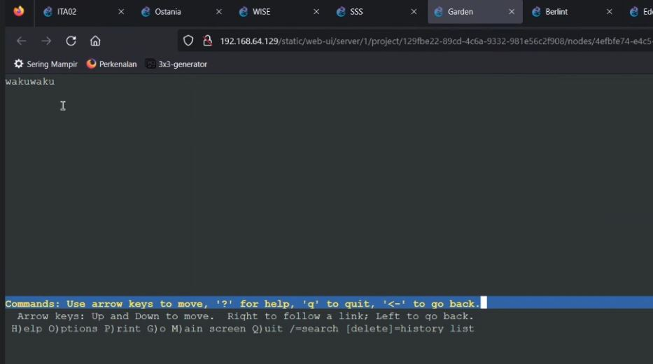

## Laporan Resmi Modul 2 Praktikum Jaringan Komputer 2022
---
### Kelompok ITA02:
1. Muhammad Faris Anwari (5027201008)
2. Calvindra Laksmono Kumoro (5027201020)
3. Adinda Putri Audyna (5027201073)
    
Dibuat topologi seperti berikut ini:

### Soal No 1
WISE akan dijadikan sebagai DNS Master, Berlint akan dijadikan DNS Slave, dan Eden akan digunakan sebagai Web Server. Terdapat 2 Client yaitu SSS, dan Garden. Semua node terhubung pada router Ostania, sehingga dapat mengakses internet (1). 
### Jawaban No 1
Pada bagian ini, open terminal WISE lalu buka `nano /etc/bind/named.conf.options` dan comment bagian dnssec dan mengetikkan allow query seperti berikut: 

Setelah itu, buka `nano /etc/bind/named.conf.local` dan atur agar WISE bertipe Master juga also-notify dan allow-transfer `192.211.2.2` yang merupakan Berlint seperti berikut: 

Pada bagian Berlint juga perlu disetup dengan membuka terminal Berlint lalu ketik `cat /etc/bind/named.conf.local` dan atur agar berlint bertipe Slave seperti berikut: 

Setelah itu, buka `cat /etc/bind/named.conf.options` dan atur seperti berikut:

### Soal No 2
Untuk mempermudah mendapatkan informasi mengenai misi dari Handler, bantulah Loid membuat website utama dengan akses wise.yyy.com dengan alias www.wise.yyy.com pada folder wise (2). 

### Jawaban No 2
Buat folder wise dengan `mkdir /etc/bind/wise` dan lakukan copy `cp /etc/bind/db.local /etc/bind/wise/wise.ITA02.com` dan lakukan edit dengan `nano /etc/bind/wise/wise.ITA02.com` dengan isi seperti berikut:

Contoh melakukan `ping www.wise.ITA02.com -c 3` dari terminal lain dan dapat berhasil seperti berikut:

Hal tersebut berhasil dikarenakan sebelumnya kita sudah mengisikan `nano /etc/resolv.conf` dengan memberitahu name servernya seperti berikut:

### Soal No 3
Setelah itu ia juga ingin membuat subdomain eden.wise.yyy.com dengan alias www.eden.wise.yyy.com yang diatur DNS-nya di WISE dan mengarah ke Eden (3). 

### Jawaban No 3
Buka di terminal wise `nano /etc/bind/wise/wise.ITA02.com` dan menambahkan eden ke arah ipnya eden dan membuat alias cname ke www.eden untuk mengaliaskan ke eden.wise.ITA02.com. seperti berikut:

Untuk membuktikannya bisa dilakukan `ping www.eden.wise.ITA02.com -c 4` dan berhasil keluar seperti berikut:

### Soal No 4
Buat juga reverse domain untuk domain utama (4). 

### Jawaban No 4
Buka di terminal wise `nano /etc/bind/named.conf.local` dan menambahkan reverse domain seperti berikut:

Lalu lakukan copy dengan `cp /etc/bind/db.local /etc/bind/wise/3.211.192.in-addr.arpa` dan edit `nano /etc/bind/wise/3.211.192.in-addr.arpa` seperti berikut:

Untuk membuktikannya dapat dilakukan `host -t PTR 192.211.3.2` dan diperoleh hasil berikut:

## Soal 5
Agar dapat tetap dihubungi jika server WISE bermasalah, buatlah juga Berlint sebagai DNS Slave untuk domain utama 
## Jawaban No 5:
untuk bisa membuat Berlint sebagai DNS Slave untuk domain utama, ketikkan `nano /etc/bind/named.conf.local` pada command di WISE. Dan masukkan syntax-syntax ini

, dimana 2.2 itu adalah slave dari berlint

Kemudian kita harus memastikan sudah melakukan `apt-get update` dan memiliki bind9 dengan cara `apt-get install bind9 -y` karena Berlint akan dijadikan DNS Slave. Dan konfigurasi yang dilakukan pada Berlint untuk menjadi slave yaitu, ketikkan `nano /etc/bind/named.conf.local` dan masukkan ini:

Kemudian restart bind9 dengan `service bind9 restart` pada kedua node. Untuk membuktikan hubungan master-slave WISE dan Berlint, pertama atur `resolv.conf` di node Garden sehingga mengarah ke node WISE dan Berlint.

Kemudian, matikan bind9 di node WISE.

Coba hubungi `wise.ITA02.com` dari node Garden.

## Soal 6
Karena banyak informasi dari Handler, buatlah subdomain yang khusus untuk operation yaitu operation.wise.yyy.com dengan alias www.operation.wise.yyy.com yang didelegasikan dari WISE ke Berlint dengan IP menuju ke Eden dalam folder operation 
## Jawaban No 6:

### Wise
Pada Wise kami melakukan konfigurasi pada /etc/bind/wise/wise.ITA02.com dengan nano:

dan ada tambahan barisan baru yaitu bagian ns1 dan operation yang digunakan menambahkan domain asli yaitu wise.ITA02.com dan nanti ada variabel ns1 yang mendahului wise, dimana variabel itu adalah operation. Dan disitu kita mengarahkannya pada 192.211.2.2(Berlint) karena berlint menjadi handler. 

Kemudian cek terlebih dahulu pada name.conf.local (nano/etc/bind/named.conf.local)

Bisa dilihat disini berlint menjadi subdomain pada syntax zone `operation.wise.ITA02.com`
Kemudian pada web console berlint kita buat folder dengan syntax `mkdir /etc/bind/operation`. Setelah itu kita copy dengan syntax `cp/etc/bind/db.local` ke `/etc/bind/operation/operation.wise.ITA02.com`. Dan kita lihat isi filenya dengan syntax `nano /etc/bind/operation/operation.wise.ITA02.com`

Bisa dilihat pada syntax mengarahkan dari subdomain ke  192.211.2.3. Dan CNAME itu untuk alias.

## Soal 7
Untuk informasi yang lebih spesifik mengenai Operation Strix, buatlah subdomain melalui Berlint dengan akses strix.operation.wise.yyy.com dengan alias www.strix.operation.wise.yyy.com yang mengarah ke Eden (7) 

## Jawaban No 7:
Pada nomor 7 tinggal menambahkan ini pada `etc/bind/operation/operation.wise.ITA02.com` dengan menggunakan nano, dan dimana awalnya hanya ada 3 baris saja sebelumnya.

Kita cek apabila berhasil dengan ping www.operation.wise.ITA02.com -c 3, ping strix.operation.wise.ITA02.com -c 3

## Soal 8
Setelah melakukan konfigurasi server, maka dilakukan konfigurasi Webserver. Pertama dengan webserver www.wise.yyy.com. Pertama, Loid membutuhkan webserver dengan DocumentRoot pada /var/www/wise.yyy.com

## Jawaban No 8:
Pertama pastikan dahulu kita sudah menginstall apache, php. Setelah itu ada folder baru namanya etc/apache2. Kemudian kita cd sites-available. Kemudian kita copy 000-default.conf ke wise.ITA02.com.conf dengan perintah cp. 
Dan nantinya kita perlu ubah-ubah pada bagian ini sehingga menjadi seperti ini 

Aktifkan site tersebut dengan command `a2ensite wise.ITA02.com`, lalu input command `service apache2 reload` dan `service apache2 restart`.

Kemudian kita cd /var/www, kemudian kita buat folder dengan mkdir wise.ITA02.com, dan masuk folder tersebut. Kemudian kita `wget -o nama file "link dari zip"`, dan bisa kita rename filenya dengan contoh wise.zip. Dan kita perlu juga menginstall unzip. Setelah selesai mempunyai unzip, kita unzip wise.zip. Kemudian kita mkdir wise dan kita move dengan `mv wise/*` ke `/var/www/wise.ITA02.com`. Selanjutnya kita rm wise.zip dan rmdir wise.

Kemudian kita lynx wise.ITA02.com akan menampilkan 

### Soal No 9
Setelah itu, Loid juga membutuhkan agar url www.wise.yyy.com/index.php/home dapat menjadi menjadi www.wise.yyy.com/home (9).

### Jawaban No 9
Untuk soal ini, kita akan mengunjungi kembali `/etc/apache2/sites-available/wise.ITA02.com` dan tambahkan baris `Alias "/home" "/var/www/wise.ITA02.com/index.php/home"` sebagaimana berikut:

Kemudian, dapat dites dengan mencoba `lynx wise.ITA02.com/home`.

### Soal No 10
Setelah itu, pada subdomain www.eden.wise.yyy.com, Loid membutuhkan penyimpanan aset yang memiliki DocumentRoot pada /var/www/eden.wise.yyy.com (10). 

### Jawaban No 10
Serupa dengan nomor 8, kita kopi 000-default.conf ke `/etc/apache2/sites-available/eden.wise.ITA02.com.conf` dan ganti isinya sebagai berikut:

Aktifkan website, kemudian download konten subdomain dan taruh di `/var/www/eden.wise.ITA02.com`. Uji kesiapan website dengan mengaksesnya dari node Garden.

### Soal No 11
Akan tetapi, pada folder /public, Loid ingin hanya dapat melakukan directory listing saja (11). 

### Jawaban No 11
Akses `/etc/apache2/sites-available/eden.wise.ITA02.com.conf`, dan tambahkan code berikut:

Jangan lupa reload dan restart apache. Tes dari node lain.

### Soal No 12
Tidak hanya itu, Loid juga ingin menyiapkan error file 404.html pada folder /error untuk mengganti error kode pada apache (12). 

### Jawaban No 12
Akses `/etc/apache2/sites-available/eden.wise.ITA02.com.conf`, dan tambahkan code berikut:

Lalu coba akses subdomain eden dengan argumen asal.

## Soal 13
Loid juga meminta Franky untuk dibuatkan konfigurasi virtual host. Virtual host ini bertujuan untuk dapat mengakses file asset www.eden.wise.yyy.com/public/js menjadi www.eden.wise.yyy.com/js 

## Jawaban No 13:
Kita tinggal mengubah, dengan masuk terlebih dahulu dengan syntax `nano /etc/apache2/sites-available/eden.wise.ITA02.com.conf` dan kita tambahkan ini 

## Soal 16
dan setiap kali mengakses IP Eden akan dialihkan secara otomatis ke www.wise.yyy.com

## Jawaban No 16:
nano /etc/apache2/sites-available pada 000-default.conf. Dan kita tambahkan bagian ini 

Fungsi dari redirect permanent ini gunanya untuk me redirect yang seharusnya masuk pada destination sitenya.

Kemudian coba akses IP node Eden dengan `lynx 192.211.2.3`

